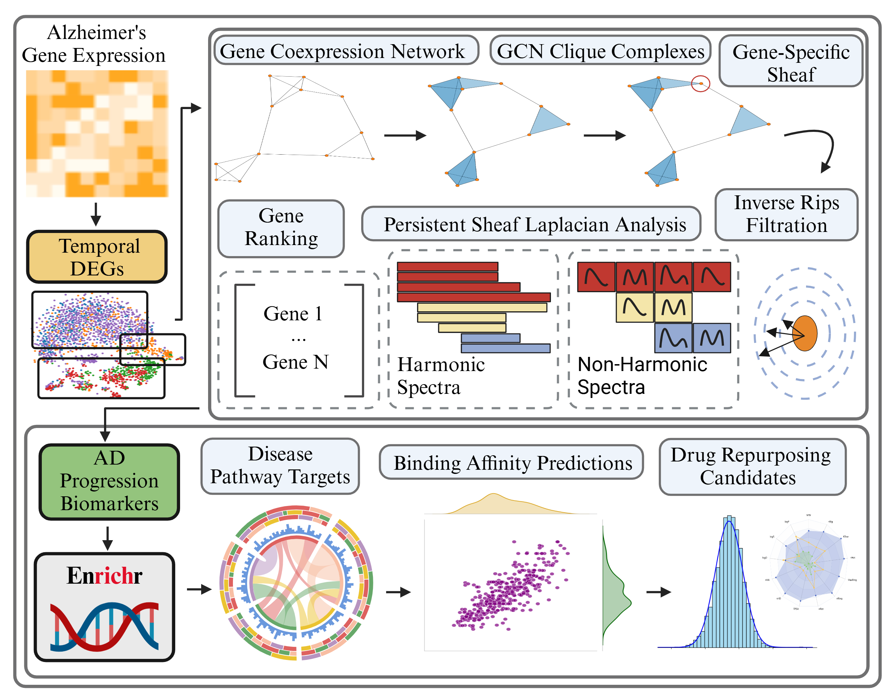

# Persistent Sheaf Laplacian Analysis of Gene Co-Expression Networks

This repository contains the code for constructing Gene Coexpression Networks, conducting topological perturbations of said networks, analyzing the topological significance of each gene via Persistent Sheaf Laplacian Spectrum analysis, and then extracting the significant genes throughout a correlation based inverse-filtration. Specifically, given a set of gene expression values as well as some segmentation of the cells (according to cell type or disease progression) we calculate the significantly differentially expressed genes of each cell group. From these DEGs we can construct a group specific Gene Co-Expression Network and its corresponding clique complex for topological analysis. 

For each gene we may assign a gene labeling either to emphasize it in the network (a gene-specific sheaf) or to reflect its up/down regulation in that group (its LogFC value among the DEGs). Given the network and gene labelings, Persistent Sheaf Laplacian analysis gives a cell specific topological description of the GCN from which we can infer the significance of each gene. Genes that are revealed as being more topologically significant are hypothesized to be biomarkers or therapeutic targtets for the disease of interest (i.e. AD). 

From the set of inferred biomarkers we can cross reference these with pathway enrichment libraries or the scientific literature, as well as binding affinity data repositories such as ChEMBL, to perform a computational drug repurposing of DrugBank small compounds for targeting different targets in AD. Among these repurposed drugs we also do a toxicity analysis using ADMET Lab3.0. 

The base of the code for calculating the Persistent Sheaf Laplacians was obtained from the following repository: https://github.com/weixiaoqimath/persistent_sheaf_Laplacians/blob/main/PSL.py

The only adjustments made to the code for the purpose of this study was to enable the PSL function to handle a network input and construct clique complexes from this rather than constructing a simplicial complex from a point cloud input. We also removed the L2 Laplacian computation for convenience. 

# Files 
In this repository are several files needed for reproducing the results in our study. ... 

# Citations

